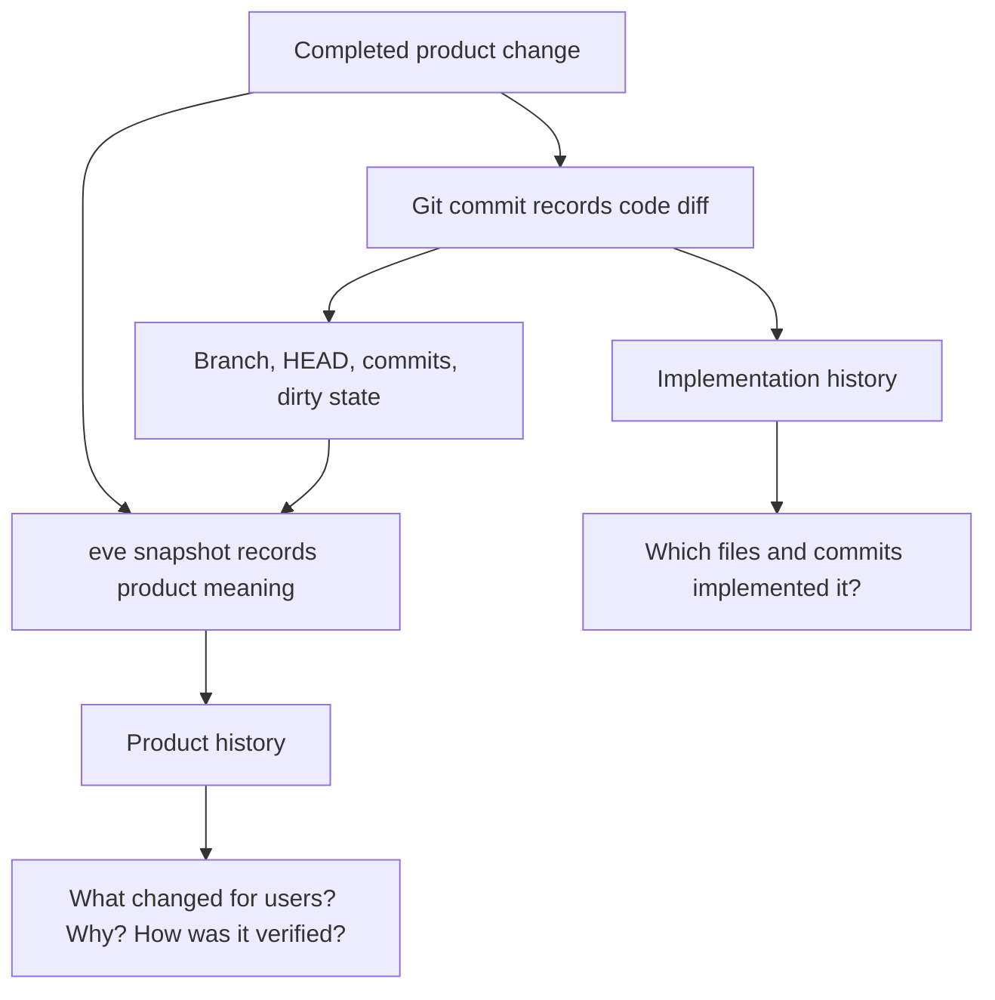

# eve

eve records completed product snapshots next to Git history.

Git is still the source of truth for implementation checkpoints. eve adds a
small product-history layer for the completed unit of work: a feature, bug fix,
experiment, refactor, or release.

## What eve Stores

Canonical product history lives in the repository:

```text
.eve/
  config.json
  snapshots/*.json
  artifacts/<snapshot-id>/*
  cache/
```

`.eve/snapshots/*.json` is canonical. `.eve/cache/` is rebuildable.

## Run Locally

Prerequisites:

- Go 1.26+
- Node.js and npm, only when rebuilding the web UI

From this checkout:

```sh
npm --prefix ui ci
npm --prefix ui run build
go run ./cmd/eve init
go run ./cmd/eve dev
```

Open `http://localhost:4317`.

Useful commands:

```sh
go run ./cmd/eve snapshot <snapshot-id>
go run ./cmd/eve checkout <snapshot-id>
go run ./cmd/eve checkout --force <snapshot-id>
go run ./cmd/eve validate .eve/snapshots/<snapshot-id>.json
go run ./cmd/eve canonicalize .eve/snapshots/<snapshot-id>.json
go run ./cmd/eve version
```

Install the CLI if you want to call `eve` from other repositories:

```sh
go install ./cmd/eve
eve dev --cwd /path/to/repo
```

## Verify

```sh
go test ./...
npm --prefix ui test
npm --prefix ui run build
```

## Architecture


`eve dev` starts the local runtime on localhost. It serves the embedded web UI,
the local API, and a Streamable HTTP MCP endpoint at `/mcp`. `eve mcp-stdio`
starts the same MCP tools over stdio for agents that launch local MCP servers.

## How eve Complements Git



Agents provide product meaning such as title, type, summary, decisions, risks,
artifacts, and validation. eve derives Git facts from the repository when the
snapshot is completed.

## Local API

```text
GET  /api/config
GET  /api/repos
GET  /api/repos/{repoId}
POST /api/repos/{repoId}/open-editor
GET  /api/repos/{repoId}/snapshots
GET  /api/repos/{repoId}/snapshots/{snapshotId}
GET  /api/repos/{repoId}/snapshots/{snapshotId}/sessions
GET  /api/repos/{repoId}/snapshots/{snapshotId}/sessions/{sessionKey}
POST /api/repos/{repoId}/snapshots/{snapshotId}/checkout
POST /mcp
```

## MCP

eve exposes MCP resources:

```text
eve://repos
eve://repos/{repoId}
eve://repos/{repoId}/snapshots
eve://repos/{repoId}/snapshots/{snapshotId}
```

And MCP tools:

- `list_repos`
- `list_snapshots`
- `get_snapshot`
- `complete_snapshot`
- `skip_snapshot`
- `checkout_snapshot`

Use stdio when the agent should start eve itself. Use HTTP when `eve dev` is
already running.

### Codex

Codex reads MCP servers from `~/.codex/config.toml`, or from a trusted
project-scoped `.codex/config.toml`.

Stdio:

```toml
[mcp_servers.eve]
command = "eve"
args = ["mcp-stdio", "--cwd", "/path/to/repo"]
startup_timeout_sec = 20
tool_timeout_sec = 120
```

Or add it with the Codex CLI:

```sh
codex mcp add eve -- eve mcp-stdio --cwd /path/to/repo
```

HTTP, after `eve dev --cwd /path/to/repo`:

```toml
[mcp_servers.eve]
url = "http://localhost:4317/mcp"
startup_timeout_sec = 20
tool_timeout_sec = 120
```

Use `/mcp` in Codex to confirm the server is connected.

### Claude Code

Personal or project-local stdio setup:

```sh
claude mcp add --transport stdio eve -- eve mcp-stdio --cwd "$PWD"
```

Team-shared project setup in `.mcp.json`:

```json
{
  "mcpServers": {
    "eve": {
      "command": "eve",
      "args": ["mcp-stdio", "--cwd", "${CLAUDE_PROJECT_DIR:-.}"]
    }
  }
}
```

HTTP, after `eve dev`:

```sh
claude mcp add --transport http eve http://localhost:4317/mcp
```

Use `/mcp` or `claude mcp list` to check status. Claude Code asks for approval
before using project-scoped `.mcp.json` servers.

### opencode

Add a local server to `opencode.json`:

```json
{
  "$schema": "https://opencode.ai/config.json",
  "mcp": {
    "eve": {
      "type": "local",
      "command": ["eve", "mcp-stdio", "--cwd", "/path/to/repo"],
      "enabled": true
    }
  }
}
```

Or connect to the running HTTP endpoint:

```json
{
  "$schema": "https://opencode.ai/config.json",
  "mcp": {
    "eve": {
      "type": "remote",
      "url": "http://localhost:4317/mcp",
      "enabled": true
    }
  }
}
```

Check with:

```sh
opencode mcp list
```

### Other Agents

Use whichever MCP transport the client supports:

- Stdio: run `eve mcp-stdio --cwd /path/to/repo`.
- Streamable HTTP: run `eve dev --cwd /path/to/repo`, then connect to
  `http://localhost:4317/mcp`.

Keep local HTTP bound to localhost. MCP clients can expose powerful repo tools,
so only connect agents and servers you trust.

## Library

```go
snapshot, err := eve.ParseSnapshot(data)
if err != nil {
    return err
}

if err := eve.ValidateSnapshot(snapshot); err != nil {
    return err
}

canonical, err := eve.CanonicalSnapshotJSON(snapshot)
```

Public package APIs:

- `ParseSnapshot([]byte) (*Snapshot, error)`
- `ValidateSnapshot(*Snapshot) error`
- `CanonicalSnapshotJSON(*Snapshot) ([]byte, error)`
- `LoadSnapshotFile(path string) (*Snapshot, error)`

## Docs Checked

- [Model Context Protocol transports](https://modelcontextprotocol.io/specification/2025-06-18/basic/transports)
- [Codex MCP](https://developers.openai.com/codex/mcp)
- [Claude Code MCP](https://code.claude.com/docs/en/mcp)
- [opencode MCP servers](https://opencode.ai/docs/mcp-servers/)
