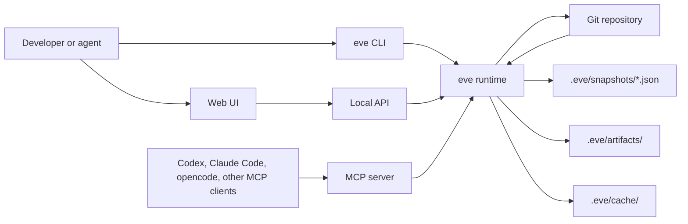
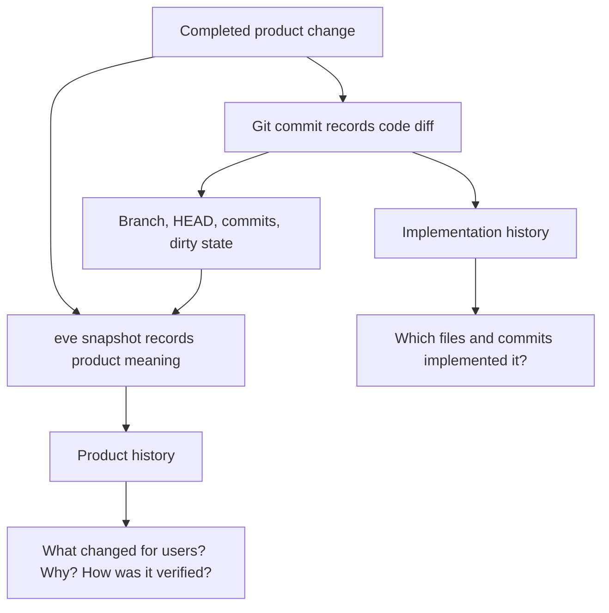

# eve

git tracks code, eve tracks product.

eve records the product meaning behind completed work: what changed for users,
why it changed, how it was verified, and which Git state implemented it.

Git remains the source of truth for implementation history. eve adds a small
repository-native layer for the completed product unit: a feature, bug fix,
experiment, refactor, or release.

## Preview


## Quick Start

Install EVE once for the current user:

```sh
npx --yes @nhestrompia/eve@latest install
```

The installer downloads and verifies the EVE binary, adds it to a user-owned
bin directory, and configures Codex, Claude Code, and opencode with its absolute
path. The installed `eve` command can be used from any Git repository.

Initialize EVE in each repository where you want to record product history:

```sh
cd /path/to/repository
eve init
eve doctor
```

Installation does not start a global EVE service. Snapshots belong to the local
repository, so run EVE inside the repository whose history you want to inspect.

To start the local UI, API, and HTTP MCP endpoint:

```sh
cd /path/to/repository
eve dev
```

Then open `http://localhost:4317`. The UI shows Snapshots from that repository,
and the HTTP MCP endpoint is available at `http://localhost:4317/mcp` while
`eve dev` is running.

The installer configures agent clients to use EVE over stdio. In that mode the
agent client starts EVE for the active repository when needed; there is no
always-running global MCP process.

Installer options:

```sh
npx --yes @nhestrompia/eve@latest install --clients codex,claude
npx --yes @nhestrompia/eve@latest install --no-mcp
```

The installer prints a shell-profile instruction if its user bin directory is
not already on `PATH`.

## What eve Stores

Canonical product history lives in the repository:

```text
.eve/
  config.json
  snapshots/*.json
  artifacts/<snapshot-id>/*
  cache/
```

`.eve/snapshots/*.json` is canonical. `.eve/cache/` is rebuildable.

## Development from Source

Prerequisites:

- Go 1.26+
- Node.js and npm, only when rebuilding the web UI

From this checkout:

```sh
npm --prefix ui ci
npm --prefix ui run build
go run ./cmd/eve init
go run ./cmd/eve instructions status
go run ./cmd/eve doctor
go run ./cmd/eve dev
```

Open `http://localhost:4317`.

Run the documentation site only when editing or verifying documentation:

```sh
npm --prefix site ci
npm --prefix site run dev
npm --prefix site run build
```

Useful commands:

```sh
go run ./cmd/eve add --title "Add GitHub OAuth" --type feature --summary "Users can now sign in with GitHub." --validation "go test ./..."
go run ./cmd/eve commit
go run ./cmd/eve snapshot <snapshot-id>
go run ./cmd/eve changelog --since <snapshot-id> --markdown
go run ./cmd/eve compare <from-snapshot-id> <to-snapshot-id> --markdown
go run ./cmd/eve checkout <snapshot-id>
go run ./cmd/eve checkout --force <snapshot-id>
go run ./cmd/eve validate .eve/snapshots/<snapshot-id>.json
go run ./cmd/eve canonicalize .eve/snapshots/<snapshot-id>.json
go run ./cmd/eve version
```

`eve init` also installs a concise, versioned EVE instruction block in
`AGENTS.md` and `CLAUDE.md`. Existing repository guidance is preserved outside
the managed markers. Use `eve init --no-agent-instructions` to opt out, or
`eve init --instructions-only` to install the guidance without changing
`.eve/` state.

Manage and diagnose the instruction files explicitly with:

```sh
eve instructions install
eve instructions install --target agents
eve instructions install --target claude
eve instructions status
eve instructions diff
eve doctor
```

Modified managed blocks are never overwritten automatically. Inspect them with
`eve instructions diff`, then use `eve instructions install --force` only when
you intend to restore the canonical template. Malformed or duplicate markers
must be resolved manually.

Useful installed commands:

```sh
eve version
eve install-mcp
eve doctor
eve dev
```

## Verify

For normal product or CLI development:

```sh
go test ./...
npm --prefix npm/eve test
npm --prefix npm/eve run pack:check
npm --prefix ui test
npm --prefix ui run build
```

For documentation-site changes only:

```sh
npm --prefix site ci
npm --prefix site run build
```

## Releases

Releases are created from Git tags:

```sh
git tag v0.2.0
git push origin v0.2.0
```

The GitHub Actions release workflow builds `eve` binaries for Linux, macOS, and
Windows, publishes them with a checksum manifest to a GitHub release, and
publishes the matching `@nhestrompia/eve` installer to npm. The repository must
provide an npm automation token as the `NPM_TOKEN` GitHub Actions secret.

## Repository Practices

This repository includes:

- `LICENSE`
- `CONTRIBUTING.md`
- `SECURITY.md`
- `CHANGELOG.md`
- CI for Go, embedded UI, and docs site verification
- Dependabot configuration for Go modules, npm packages, and GitHub Actions

For completed product changes in this repository, commit the implementation,
record the product change with eve, then commit the generated `.eve/` record.

## Architecture



`eve dev` starts the local runtime on localhost. It serves the embedded web UI,
the local API, and a Streamable HTTP MCP endpoint at `/mcp`. `eve mcp-stdio`
starts the same MCP tools over stdio for agents that launch local MCP servers.

## How eve Complements Git



Agents provide product meaning such as title, type, summary, decisions, risks,
artifacts, and validation. eve derives Git facts from the repository when the
snapshot is completed.

## Local API

`eve dev` serves the repository-scoped API on `http://localhost:4317`. See the
[local API reference](site/content/docs/reference/local-api.mdx) for endpoints
and response details.

## MCP

eve exposes MCP resources:

```text
eve://repos
eve://repos/{repoId}
eve://repos/{repoId}/snapshots
eve://repos/{repoId}/snapshots/{snapshotId}
```

And MCP tools:

- `list_repos`
- `list_snapshots`
- `get_snapshot`
- `pending_snapshot`
- `complete_snapshot`
- `skip_snapshot`
- `checkout_snapshot`

Agents should prefer the MCP `complete_snapshot` tool when available. The CLI
also supports a two-step flow for shells and agent hosts without MCP access:

```sh
eve add --title "Add GitHub OAuth" \
  --type feature \
  --summary "Users can now sign in with GitHub." \
  --validation "go test ./..."
eve commit
```

`eve add` writes a draft under `.eve/staged/`; `eve commit` validates it,
derives Git facts from the repository, writes `.eve/snapshots/<id>.json`, and
removes the draft. The implementation working tree must be clean by default.

`skip_snapshot` requires a non-empty reason and writes `.eve/skips/<id>.json`.
Skip records resolve committed work that was reviewed but intentionally not
snapshotted; they are not shown as product-history Snapshots.

The `npx` installer configures supported clients automatically. To update that
configuration later, run:

```sh
eve install-mcp
```

The default stdio setup has no hard-coded repository path. The agent client
starts `eve mcp-stdio` from its active workspace, and EVE finds the nearest Git
root. If the client starts MCP elsewhere, pin the repository with
`eve install-mcp --cwd /path/to/repo`.

Use HTTP MCP only while `eve dev` is running inside the target repository.

For client-specific and manual configuration, see the
[MCP setup guide](site/content/docs/agents/mcp.mdx). Keep HTTP MCP bound to
localhost, and only connect agents and servers you trust.

## Library

```go
snapshot, err := eve.ParseSnapshot(data)
if err != nil {
    return err
}

if err := eve.ValidateSnapshot(snapshot); err != nil {
    return err
}

canonical, err := eve.CanonicalSnapshotJSON(snapshot)
```

Public package APIs:

- `ParseSnapshot([]byte) (*Snapshot, error)`
- `ValidateSnapshot(*Snapshot) error`
- `CanonicalSnapshotJSON(*Snapshot) ([]byte, error)`
- `LoadSnapshotFile(path string) (*Snapshot, error)`
