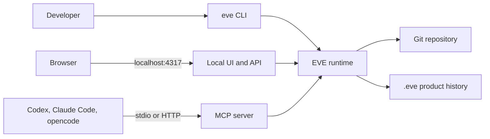

# eve

Git tracks code. eve tracks the product meaning behind completed work: what
changed for users, why it changed, and how it was verified.

## Install eve

Install EVE once, then use it from any Git repository:

```sh
npx --yes @nhestrompia/eve@latest install
```

The installer adds the `eve` CLI to a user-owned bin directory and configures
Codex, Claude Code, and opencode to use EVE over MCP. Restart your agent client
after installation so it reloads its MCP configuration.

## Run eve Locally

eve is installed globally, but its data and runtime are local to each
repository. Initialize the repository you want to use:

```sh
cd /path/to/repository
eve init
```

Start the local UI, API, and HTTP MCP endpoint from that repository:

```sh
eve dev
```

Open `http://localhost:4317` to view its Snapshots. The HTTP MCP endpoint is
available at `http://localhost:4317/mcp` while `eve dev` is running.


## Use eve with Agents

The installer configures supported agents to launch eve over stdio. Open your
agent in an initialized repository; the agent starts EVE for that active
workspace when it needs MCP tools. There is no always-running global MCP
process.

EVE gives agents tools to inspect product history and record completed work,
including `list_snapshots`, `get_snapshot`, `complete_snapshot`, and
`skip_snapshot`.

To refresh the MCP configuration later:

```sh
eve install-mcp
```

To use HTTP MCP instead of stdio, run `eve dev` in the target repository and
connect the agent to `http://localhost:4317/mcp`.

## Architecture



The CLI is available globally. The runtime, UI, MCP tools, Git state, and
`.eve/` history are scoped to the repository where EVE is running.
