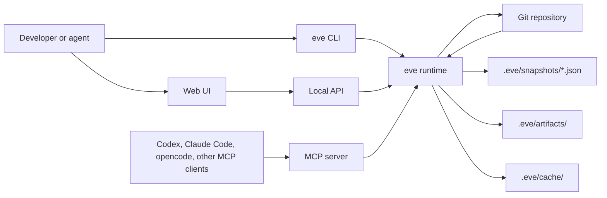
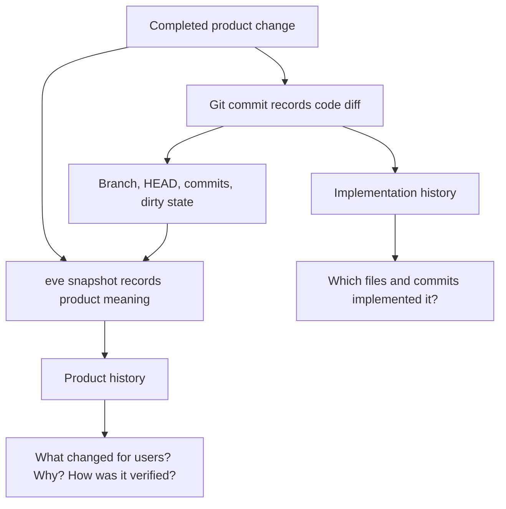

# eve

git tracks code, eve tracks product.

eve records the product meaning behind completed work: what changed for users,
why it changed, how it was verified, and which Git state implemented it.

Git remains the source of truth for implementation history. eve adds a small
repository-native layer for the completed product unit: a feature, bug fix,
experiment, refactor, or release.

## Preview


## Website and Documentation

This repository includes a functional documentation website in `site/`, built
with Next.js and Fumadocs. You do not need to run the docs site to use eve from
a fork or local checkout.

Only run the docs site when you are editing documentation or preparing a docs
deployment:

```sh
npm --prefix site ci
npm --prefix site run dev
```

Build it:

```sh
npm --prefix site run build
```

The site is ready for Vercel deployment. Use `site` as the project root, keep
the default Next.js build command, and publish from Vercel's generated output.

The docs explain:

- What eve records and why it complements Git
- How snapshots, validation, artifacts, and relationships work
- How coding agents should read and write eve history
- CLI, MCP, local API, and snapshot schema reference

## What eve Stores

Canonical product history lives in the repository:

```text
.eve/
  config.json
  snapshots/*.json
  artifacts/<snapshot-id>/*
  cache/
```

`.eve/snapshots/*.json` is canonical. `.eve/cache/` is rebuildable.

## Run Locally

Prerequisites:

- Go 1.26+
- Node.js and npm, only when rebuilding the web UI

From this checkout:

```sh
npm --prefix ui ci
npm --prefix ui run build
go run ./cmd/eve init
go run ./cmd/eve dev
```

Open `http://localhost:4317`.

Useful commands:

```sh
go run ./cmd/eve add --title "Add GitHub OAuth" --type feature --summary "Users can now sign in with GitHub." --validation "go test ./..."
go run ./cmd/eve commit
go run ./cmd/eve snapshot <snapshot-id>
go run ./cmd/eve checkout <snapshot-id>
go run ./cmd/eve checkout --force <snapshot-id>
go run ./cmd/eve validate .eve/snapshots/<snapshot-id>.json
go run ./cmd/eve canonicalize .eve/snapshots/<snapshot-id>.json
go run ./cmd/eve version
```

Install the CLI if you want to call `eve` from other repositories:

```sh
go run ./cmd/eve install-mcp --install
```

That one command runs `go install ./cmd/eve`, finds the installed binary, and
adds eve to Codex, Claude Code, and opencode MCP config with an absolute command
path. GUI apps and agent hosts often do not inherit the same `PATH` as your
interactive shell, so `command = "eve"` can fail even after a successful
install.

Useful installed commands:

```sh
EVE_BIN_DIR="$(go env GOBIN)"
[ -n "$EVE_BIN_DIR" ] || EVE_BIN_DIR="$(go env GOPATH)/bin"
EVE_BIN="$EVE_BIN_DIR/eve"
"$EVE_BIN" version
"$EVE_BIN" install-mcp
"$EVE_BIN" dev
```

## Verify

For normal product or CLI development:

```sh
go test ./...
npm --prefix ui test
npm --prefix ui run build
```

For documentation-site changes only:

```sh
npm --prefix site ci
npm --prefix site run build
```

## Releases

Releases are created from Git tags:

```sh
git tag v0.2.0
git push origin v0.2.0
```

The GitHub Actions release workflow builds `eve` binaries for Linux, macOS, and
Windows, then publishes them to a GitHub release.

## Repository Practices

This repository includes:

- `LICENSE`
- `CONTRIBUTING.md`
- `SECURITY.md`
- `CHANGELOG.md`
- CI for Go, embedded UI, and docs site verification
- Dependabot configuration for Go modules, npm packages, and GitHub Actions

For completed product changes in this repository, commit the implementation,
record the product change with eve, then commit the generated `.eve/` record.

## Architecture



`eve dev` starts the local runtime on localhost. It serves the embedded web UI,
the local API, and a Streamable HTTP MCP endpoint at `/mcp`. `eve mcp-stdio`
starts the same MCP tools over stdio for agents that launch local MCP servers.

## How eve Complements Git



Agents provide product meaning such as title, type, summary, decisions, risks,
artifacts, and validation. eve derives Git facts from the repository when the
snapshot is completed.

## Local API

```text
GET  /api/config
GET  /api/repos
GET  /api/repos/{repoId}
POST /api/repos/{repoId}/open-editor
GET  /api/repos/{repoId}/snapshots
GET  /api/repos/{repoId}/snapshots/{snapshotId}
GET  /api/repos/{repoId}/snapshots/{snapshotId}/sessions
GET  /api/repos/{repoId}/snapshots/{snapshotId}/sessions/{sessionKey}
POST /api/repos/{repoId}/snapshots/{snapshotId}/checkout
POST /mcp
```

## MCP

eve exposes MCP resources:

```text
eve://repos
eve://repos/{repoId}
eve://repos/{repoId}/snapshots
eve://repos/{repoId}/snapshots/{snapshotId}
```

And MCP tools:

- `list_repos`
- `list_snapshots`
- `get_snapshot`
- `complete_snapshot`
- `skip_snapshot`
- `checkout_snapshot`

Agents should prefer the MCP `complete_snapshot` tool when available. The CLI
also supports a two-step flow for shells and agent hosts without MCP access:

```sh
eve add --title "Add GitHub OAuth" \
  --type feature \
  --summary "Users can now sign in with GitHub." \
  --validation "go test ./..."
eve commit
```

`eve add` writes a draft under `.eve/staged/`; `eve commit` validates it,
derives Git facts from the repository, writes `.eve/snapshots/<id>.json`, and
removes the draft. The implementation working tree must be clean by default.

From this checkout, the recommended setup is one command:

```sh
go run ./cmd/eve install-mcp --install
```

After eve is installed, rerun setup any time with:

```sh
EVE_BIN_DIR="$(go env GOBIN)"
[ -n "$EVE_BIN_DIR" ] || EVE_BIN_DIR="$(go env GOPATH)/bin"
EVE_BIN="$EVE_BIN_DIR/eve"
"$EVE_BIN" install-mcp
```

By default this configures Codex, Claude Code, and opencode. To configure only
some clients:

```sh
EVE_BIN_DIR="$(go env GOBIN)"
[ -n "$EVE_BIN_DIR" ] || EVE_BIN_DIR="$(go env GOPATH)/bin"
EVE_BIN="$EVE_BIN_DIR/eve"
"$EVE_BIN" install-mcp --clients codex,claude
```

To pin a specific repository instead of letting the MCP client start eve from
the active workspace:

```sh
EVE_BIN_DIR="$(go env GOBIN)"
[ -n "$EVE_BIN_DIR" ] || EVE_BIN_DIR="$(go env GOPATH)/bin"
EVE_BIN="$EVE_BIN_DIR/eve"
"$EVE_BIN" install-mcp --cwd /path/to/repo
```

If you installed eve somewhere custom, pass the absolute binary path:

```sh
EVE_BIN=/absolute/path/to/eve
"$EVE_BIN" install-mcp --eve-bin "$EVE_BIN"
```

The recommended stdio setup has no hard-coded repository path: the agent starts
`eve mcp-stdio` from the active workspace, and eve finds the nearest Git root.

Use HTTP only when `eve dev` is already running for a repository.

If an agent starts MCP servers from somewhere other than the active workspace,
set that client's MCP working directory to the workspace, set `EVE_CWD`, or pass
`--cwd`.

Quick local check:

```sh
EVE_BIN_DIR="$(go env GOBIN)"
[ -n "$EVE_BIN_DIR" ] || EVE_BIN_DIR="$(go env GOPATH)/bin"
EVE_BIN="$EVE_BIN_DIR/eve"
printf '%s\n' \
  '{"jsonrpc":"2.0","id":1,"method":"initialize","params":{}}' \
  '{"jsonrpc":"2.0","id":2,"method":"tools/list","params":{}}' |
  "$EVE_BIN" mcp-stdio
```

### Manual Codex Setup

Codex reads MCP servers from `~/.codex/config.toml`, or from a trusted
project-scoped `.codex/config.toml`. For all projects, add it to
`~/.codex/config.toml`:

Stdio:

```toml
[mcp_servers.eve]
command = "/absolute/path/to/eve"
args = ["mcp-stdio"]
startup_timeout_sec = 20
tool_timeout_sec = 120
```

Or add it with the Codex CLI:

```sh
EVE_BIN_DIR="$(go env GOBIN)"
[ -n "$EVE_BIN_DIR" ] || EVE_BIN_DIR="$(go env GOPATH)/bin"
EVE_BIN="$EVE_BIN_DIR/eve"
codex mcp add eve -- "$EVE_BIN" mcp-stdio
```

If your Codex host does not start MCP servers from the active workspace, pin the
workspace explicitly:

```toml
[mcp_servers.eve]
command = "/absolute/path/to/eve"
args = ["mcp-stdio", "--cwd", "/path/to/repo"]
startup_timeout_sec = 20
tool_timeout_sec = 120
```

HTTP, after running `eve dev` in the repository:

```toml
[mcp_servers.eve]
url = "http://localhost:4317/mcp"
startup_timeout_sec = 20
tool_timeout_sec = 120
```

Use `/mcp` in Codex to confirm the server is connected.

### Manual Claude Code Setup

User-wide stdio setup:

```sh
EVE_BIN_DIR="$(go env GOBIN)"
[ -n "$EVE_BIN_DIR" ] || EVE_BIN_DIR="$(go env GOPATH)/bin"
EVE_BIN="$EVE_BIN_DIR/eve"
claude mcp add --scope user --transport stdio eve -- "$EVE_BIN" mcp-stdio --cwd '${CLAUDE_PROJECT_DIR:-.}'
```

Team-shared project setup in `.mcp.json` uses Claude's project directory. Use a
portable command only if every teammate has `eve` on their agent host `PATH`;
otherwise prefer user scope with an absolute command path:

```json
{
  "mcpServers": {
    "eve": {
      "command": "/absolute/path/to/eve",
      "args": ["mcp-stdio", "--cwd", "${CLAUDE_PROJECT_DIR:-.}"]
    }
  }
}
```

HTTP, after running `eve dev` in the repository:

```sh
claude mcp add --transport http eve http://localhost:4317/mcp
```

Use `/mcp` or `claude mcp list` to check status. Claude Code asks for approval
before using project-scoped `.mcp.json` servers.

### Manual opencode Setup

Add a local server to your global `opencode.json`:

```json
{
  "$schema": "https://opencode.ai/config.json",
  "mcp": {
    "eve": {
      "type": "local",
      "command": ["/absolute/path/to/eve", "mcp-stdio"],
      "enabled": true
    }
  }
}
```

Or connect to the running HTTP endpoint after `eve dev`:

```json
{
  "$schema": "https://opencode.ai/config.json",
  "mcp": {
    "eve": {
      "type": "remote",
      "url": "http://localhost:4317/mcp",
      "enabled": true
    }
  }
}
```

Check with:

```sh
opencode mcp list
```

### Pi and Other Agents

Use whichever MCP transport the client supports:

- Stdio: run `eve mcp-stdio` with the server process working directory set to
  the active repository. Prefer an absolute binary path in client config.
- Streamable HTTP: run `eve dev` in the repository, then connect to
  `http://localhost:4317/mcp`.

Keep local HTTP bound to localhost. MCP clients can expose powerful repo tools,
so only connect agents and servers you trust.

## Library

```go
snapshot, err := eve.ParseSnapshot(data)
if err != nil {
    return err
}

if err := eve.ValidateSnapshot(snapshot); err != nil {
    return err
}

canonical, err := eve.CanonicalSnapshotJSON(snapshot)
```

Public package APIs:

- `ParseSnapshot([]byte) (*Snapshot, error)`
- `ValidateSnapshot(*Snapshot) error`
- `CanonicalSnapshotJSON(*Snapshot) ([]byte, error)`
- `LoadSnapshotFile(path string) (*Snapshot, error)`

## Docs Checked

- [Model Context Protocol transports](https://modelcontextprotocol.io/specification/2025-06-18/basic/transports)
- [Codex MCP](https://developers.openai.com/codex/mcp)
- [Claude Code MCP](https://code.claude.com/docs/en/mcp)
- [opencode MCP servers](https://opencode.ai/docs/mcp-servers/)
