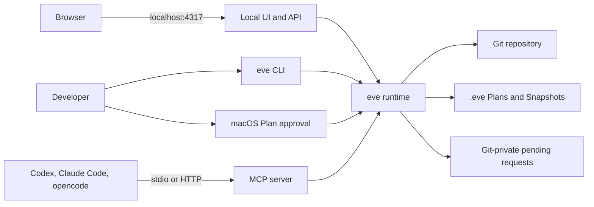

# eve

Git tracks code. eve tracks the product meaning behind completed work: what
changed for users, why it changed, and how it was verified.

## Install eve

Install eve once, then use it from any Git repository:

```sh
npx --yes @nhestrompia/eve@latest install
```

The installer adds the `eve` CLI to a user-owned bin directory and configures
Codex, Claude Code, and opencode to use eve over MCP. On macOS, it also installs
the `eve` approval app to `~/Applications/eve.app`; on Linux and Windows, it
skips the app because the native approval utility is macOS-only for now.
Restart your agent client after installation so it reloads its MCP
configuration.

## Run eve Locally

eve is installed globally, but its data and runtime are local to each
repository. Initialize the repository you want to use:

```sh
cd /path/to/repository
eve init
```

Start the local UI, API, and HTTP MCP endpoint from that repository:

```sh
eve dev
```

Open `http://localhost:4317` to view its Snapshots. The HTTP MCP endpoint is
available at `http://localhost:4317/mcp` while `eve dev` is running.


## Use eve with Agents

The installer configures supported agents to launch eve over stdio. Open your
agent in an initialized repository; the agent starts eve for that active
workspace when it needs MCP tools. There is no always-running global MCP
process.

eve gives agents tools to inspect product history, approve a Plan before
implementation, and record completed work. The core Plan flow is:

```text
declare_plan → persisted request → local approval → locked revision
             → implementation → complete_snapshot → conformance record
```

`declare_plan` requires a caller-stable `planRequestId`. If the tool call times
out, is cancelled, or either side restarts, call `get_plan_request` or call
`declare_plan` again with the same ID. The pending request is durable; the
blocking call is only a convenience. Do not modify code until the request is
locked, then pass its Plan ID and revision to `complete_snapshot`.

The installer sets Codex's generated `tool_timeout_sec` to 3600. Recovery does
not depend on that timeout. Claude Code and opencode use the same
`planRequestId` resume flow even when their client timeout differs.

To refresh the MCP configuration later:

```sh
eve install-mcp
```

To use HTTP MCP instead of stdio, run `eve dev` in the target repository and
connect the agent to `http://localhost:4317/mcp`.

## Review pending Plans

Run the long-lived local runtime from any known eve repository:

```sh
eve daemon --addr 127.0.0.1:4317
```

The macOS 13+ `eve` approval app reuses a healthy daemon or starts one when
needed. It provides a keyboard- and VoiceOver-friendly menu-bar queue for
approving, editing, or rejecting Plans. Rejection feedback is required;
approving edits creates a new immutable human revision. The local web UI also
shows a pending-plan banner that opens the same approval flow in a modal.

The approval API binds to localhost and is a trusted-local UX boundary. It is
not authentication and does not protect against a malicious process already
running as the local user.

## Architecture


```mermaid
flowchart LR
    Developer[Developer] --> CLI[eve CLI]
    Developer --> Approval[macOS Plan approval]
    Browser[Browser] -->|localhost:4317| UI[Local UI and API]
    Agents[Codex, Claude Code, opencode] -->|stdio or HTTP| MCP[MCP server]

    CLI --> Runtime[eve runtime]
    UI --> Runtime
    MCP --> Runtime
    Approval --> Runtime

    Runtime --> Git[Git repository]
    Runtime --> History[.eve Plans and Snapshots]
    Runtime --> Private[Git-private pending requests]
```

The CLI is available globally. The runtime, UI, MCP tools, Git state, and
`.eve/` history are scoped to the repository where eve is running.
